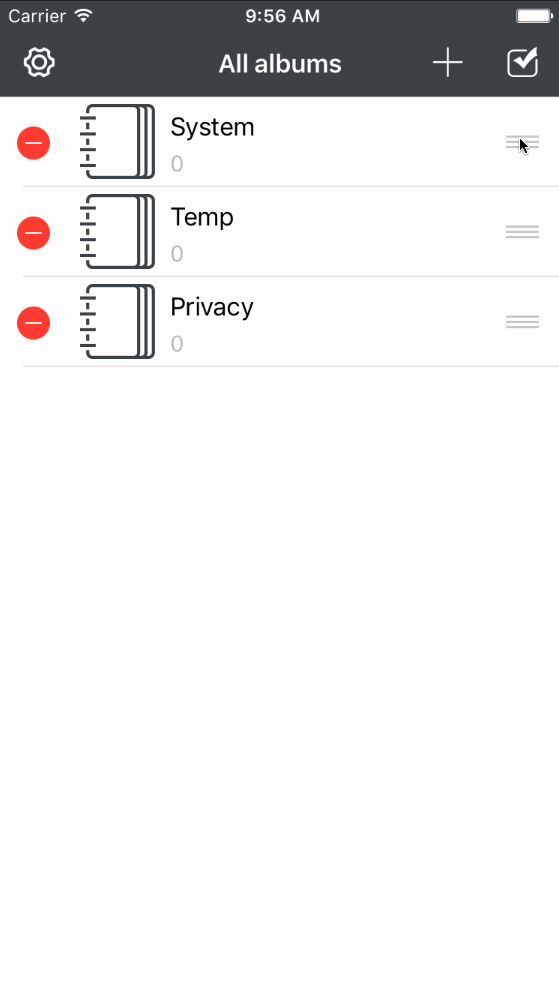
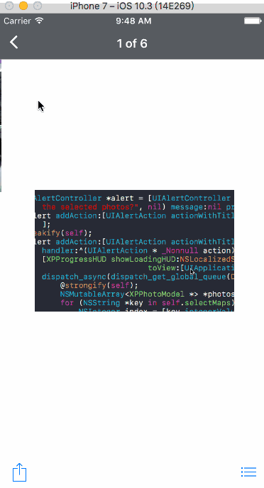

# PhotosVault

[]()
[]()
[]()

> 并不反对你使用该项目代码并上架App Store，但是严禁换个App Icon后就上架的行为。

一个管理私密相片的App

## Feature

- 支持Touch ID解锁应用
- 内置FTP服务器，可以通过FTP服务快速将图片从App拷贝到PC端

## Framework

- Photos.framework 访问系统相册/将图片存储到系统相册
- LocalAuthentication.framework 支持Touch ID快速解锁


## Requirements

- Xcode 8.1+
- iOS9.0+

## TODO

- 优化内存使用，目前是一次性加载完某个相册下的图片数据，这在大量图片的情况下将会导致内存占用率飙升，很可能会被系统kill掉，后期可以考虑采用分页加载以及其他手段进行优化
- 目前图片预览功能用的是系统的QuickLook.framework，底部的UIToolbar不支持功能扩展（不过就目前来说也足够使用），后期可以考虑采用其他第三方库

## 演示GIF



## Changlog

###### 2017/04/19

- 增加视频录制功能
- 增加对GIF／视频的支持



###### 2017/04/12

- 针对iOS10.3的新API，在设置界面中提供通过摇一摇随机更换应用图标的功能，支持iPhone/iPad
``` ObjC
- (void)setAlternateIconName:(nullable NSString *)alternateIconName completionHandler:(nullable void (^)(NSError *_Nullable error))completionHandler NS_EXTENSION_UNAVAILABLE("Extensions may not have alternate icons") API_AVAILABLE(ios(10.3), tvos(10.2));
```
- 添加`Image+Snapshot.{h/m}`文件，可以从视频/GIF文件中获取第一帧作为预览图使用，支持iOS/macOS

## License

基于MIT License进行开源，详细内容请参阅`LICENSE`文件。
